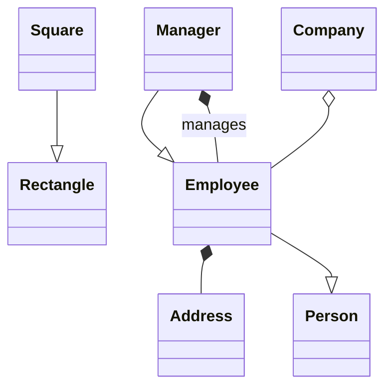

# Module 04 — Exercises

Deliverable is a Mermaid diagram per question, written in your own `Answers.md`. Time-box each to 10 minutes — speed is the skill being trained. Compare with `SOLUTIONS.md` only after.

### E1 — Relationship notation drill
For each pair, pick association / aggregation / composition / inheritance / realization / dependency, and write the Mermaid line **and** the Swift declaration:
1. `Playlist` and `Song` (songs exist without the playlist)
2. `Order` and `OrderLine`
3. `Circle` and `Shape` (protocol)
4. `EmailService` and `Logger` (passed to one method)
5. `Elevator` and `ElevatorDoor`
6. `SavingsAccount` and `Account` (class)
7. `University` and `Student`
8. `Car` and `Engine` (built in the initialiser, never replaced)

### E2 — Multiplicity drill
Write the multiplicity and the Swift property type:
1. A parking spot holds at most one vehicle.
2. A chess board has exactly 64 squares.
3. A user has zero or more addresses; one is the default.
4. A movie show has exactly one screen; a screen hosts many shows.
5. A ride has exactly one driver and one rider; a driver has many rides.

### E3 — Nouns and verbs
From these requirements, produce the entity list (including **implied** entities) and mark the fake nouns:
> "A user searches for restaurants, adds dishes to a cart, places an order, and pays by card or wallet. A delivery partner is assigned and delivers the order. The system sends notifications at every stage. Users can rate the restaurant afterwards."

### E4 — Class diagram: Splitwise (15 min)
> "Users belong to groups. Any user can add an expense to a group, paid by one user, split among several — equally, by exact amounts, or by percentage. The app shows who owes whom and supports settling up."

Requirements for your diagram: model the split strategies as a protocol; show multiplicity everywhere; mark ownership with the right diamonds; include the implied entities.

### E5 — Sequence diagram: seat booking (10 min)
Draw the flow for "user books 2 seats for a show and pays", including the failure path where payment fails after seats are locked. Participants: `User`, `BookingService`, `SeatLock`, `PaymentGateway`, `TicketService`.

### E6 — State diagram: ATM session (10 min)
States and transitions for an ATM from card insertion to card ejection, including wrong PIN (3 attempts → card retained), insufficient funds, and cash-out-of-service.

### E7 — Reverse engineering
Given this Swift, draw the class diagram exactly — including arrow types:
```swift
protocol NotificationChannel { func send(_ m: String) throws }
struct EmailChannel: NotificationChannel { let smtp: SMTPClient; func send(_ m: String) throws {} }
struct PushChannel: NotificationChannel { func send(_ m: String) throws {} }

final class NotificationService {
    private let channels: [any NotificationChannel]      // injected, shared
    private let queue = RetryQueue()                     // created and owned here
    init(channels: [any NotificationChannel]) { self.channels = channels }
    func notify(_ user: User, message: String, using formatter: Formatter) throws {}
}
```

### E8 — Spot the modelling error

Name three things wrong with this diagram and give the fix for each.
