# Module 04 — UML for LLD Interviews

> **Start with [`CONCEPTS.md`](CONCEPTS.md).** It carries the mental models, the intuition and the
> *why* behind everything below — no code. This file is the detailed reference you read second,
> once the ideas have a shape to attach to.

**Goal:** draw a correct class diagram on a whiteboard in 3 minutes, and know which of the other diagrams is worth drawing when.

**Reality check:** interviewers do not grade UML notation pedantically. They grade whether your diagram communicates **who owns what** and **who depends on whom**. But getting arrow types wrong signals you haven't thought about ownership — and ownership is the design.

All diagrams here are written in **Mermaid**, which renders in GitHub, VS Code (with the Markdown Preview Mermaid extension) and Obsidian. Keep a `.md` open beside your code as you design.

---

## 1. The five diagrams, ranked by interview value

| Diagram | Answers | Use it when | Frequency |
|---|---|---|---|
| **Class** | what types exist, who owns whom | always | ⭐⭐⭐⭐⭐ |
| **Sequence** | who calls whom, in what order | one tricky flow (booking, payment) | ⭐⭐⭐⭐ |
| **State** | how one entity's behaviour changes | vending machine, elevator, order | ⭐⭐⭐ |
| **Use case** | actors and their goals | requirement phase, 60 seconds max | ⭐⭐ |
| **Activity** | branching workflow | complex multi-step process | ⭐ |

Draw the class diagram every time. Draw exactly one sequence diagram for the hardest flow. Draw a state diagram only if an entity has real states. Everything else is optional.

---

## 2. Class diagram — the one that matters

### Anatomy of a class box

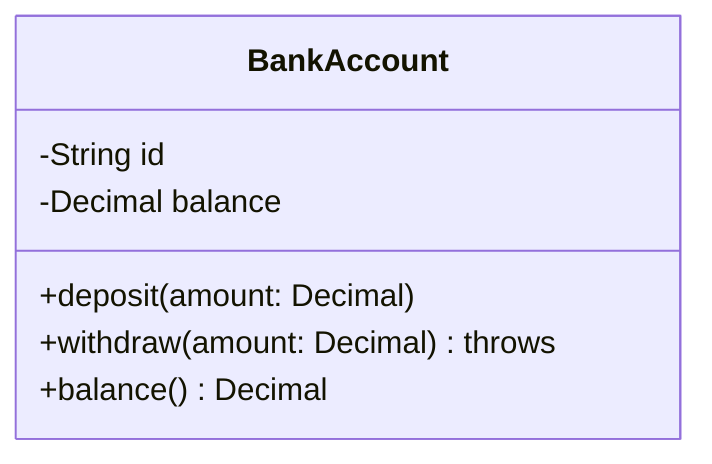

Visibility markers: `+` public · `-` private · `#` protected · `~` internal. In Swift, use `-` for `private`/`private(set)` and `+` for the public API. Static members are underlined in formal UML; in Mermaid write `+shared()$`.

Don't list every property. **List the 2–4 fields and 2–4 methods that explain the design.** A diagram with everything on it communicates nothing.

### The six relationships — this is the part people get wrong

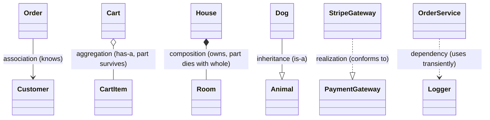

| Notation | Name | Meaning | Swift |
|---|---|---|---|
| `-->` solid arrow | **Association** | A holds a reference to B | `let customer: Customer` |
| `o--` hollow diamond | **Aggregation** | A has B, but B exists independently | `var items: [Item]` where items are shared/reused |
| `*--` filled diamond | **Composition** | A owns B; destroy A and B dies | `let engine = Engine()` created inside |
| `--|>` solid + hollow triangle | **Inheritance** | B is-a A | `class Dog: Animal` |
| `..|>` dashed + hollow triangle | **Realization** | B conforms to protocol A | `struct S: P` |
| `..>` dashed arrow | **Dependency** | A uses B in a parameter/local/return | `func log(to l: Logger)` |

**Aggregation vs composition — the test that always works:** *if the whole is destroyed, does the part still make sense?*
- `Library` and `Book`: destroy the library, the books still exist → **aggregation** (hollow diamond).
- `Order` and `OrderLine`: destroy the order, a line means nothing → **composition** (filled diamond).

Honest note: many teams use only association arrows and are never penalised. But being able to say *"I made this composition because a `Ticket` has no meaning outside its `ParkingLot`"* is a strong signal.

### Multiplicity

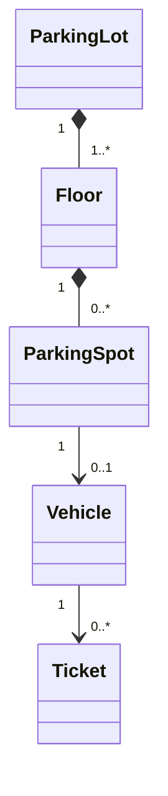

| Notation | Meaning |
|---|---|
| `1` | exactly one |
| `0..1` | optional (Swift: `Optional`) |
| `*` or `0..*` | any number (Swift: `Array`) |
| `1..*` | at least one (Swift: array + an invariant you must enforce) |

Multiplicity is where design bugs surface. "A spot has `0..1` vehicles" is the statement that a spot can't hold two cars — write it down and you'll remember to enforce it in code.

### Abstract types and protocols

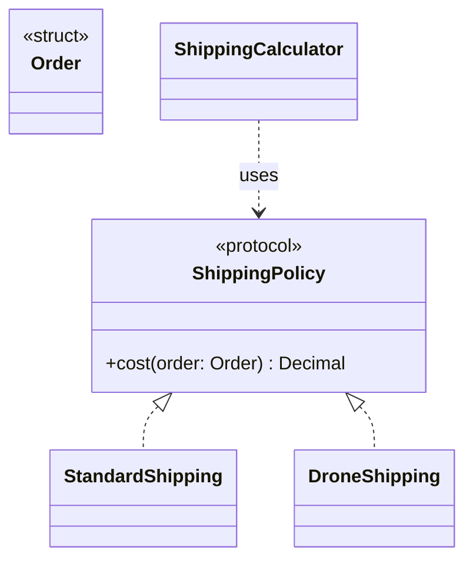
Mermaid stereotypes: `<<protocol>>`, `<<interface>>`, `<<abstract>>`, `<<enumeration>>`, `<<struct>>`. Label Swift protocols `<<protocol>>` and value types `<<struct>>` — it shows you're designing in Swift, not translating Java.

### Enums

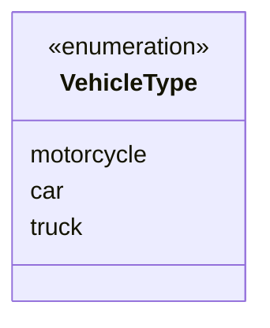

### A complete worked example — Parking Lot

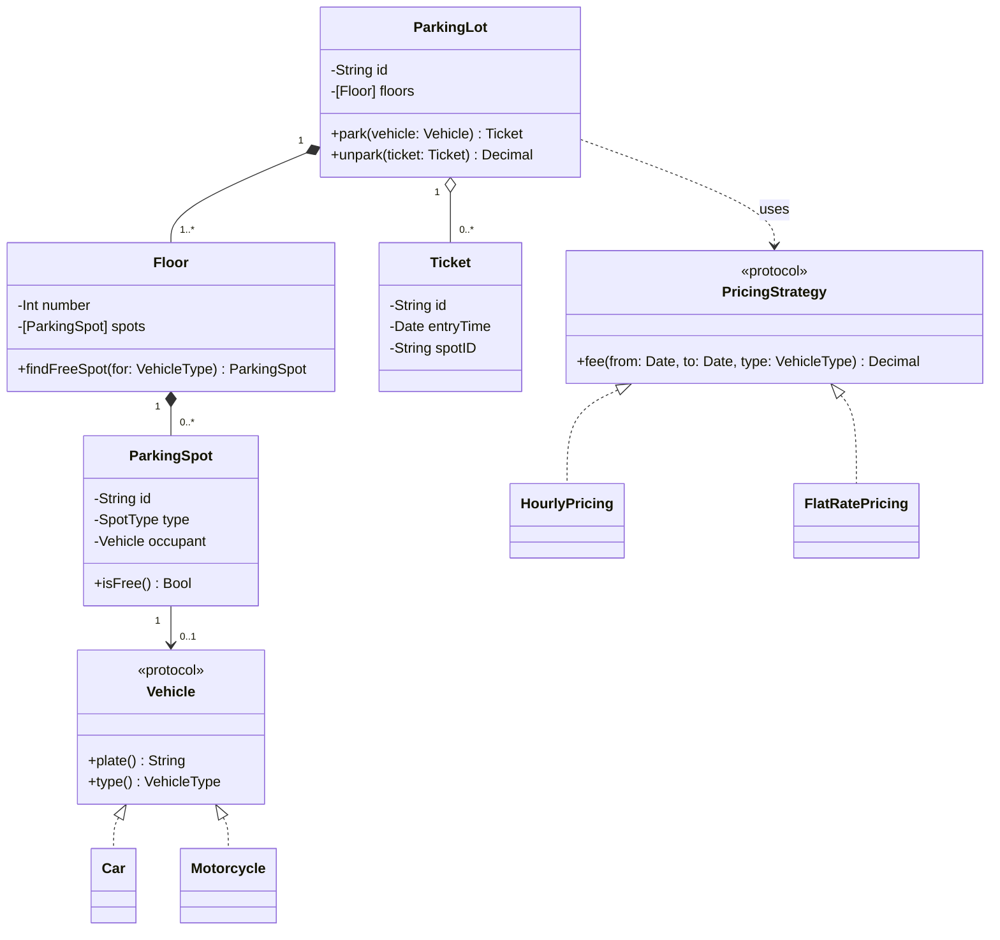

Read what the diagram already tells a reviewer: floors die with the lot (composition), a spot may be empty (`0..1`), pricing is swappable (realization + dependency), vehicle types are open for extension. That's four design decisions communicated without a word of prose. **That's the skill.**

---

## 3. Sequence diagram — for the one flow that's hard

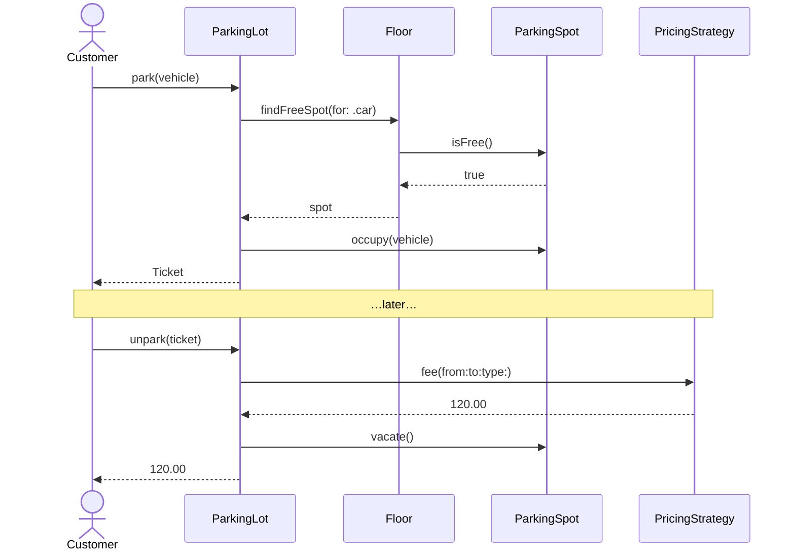

Notation: `->>` synchronous call · `-->>` return · `-)` async message · `activate`/`deactivate` for lifelines · `alt`/`else`, `opt`, `loop` for control flow:

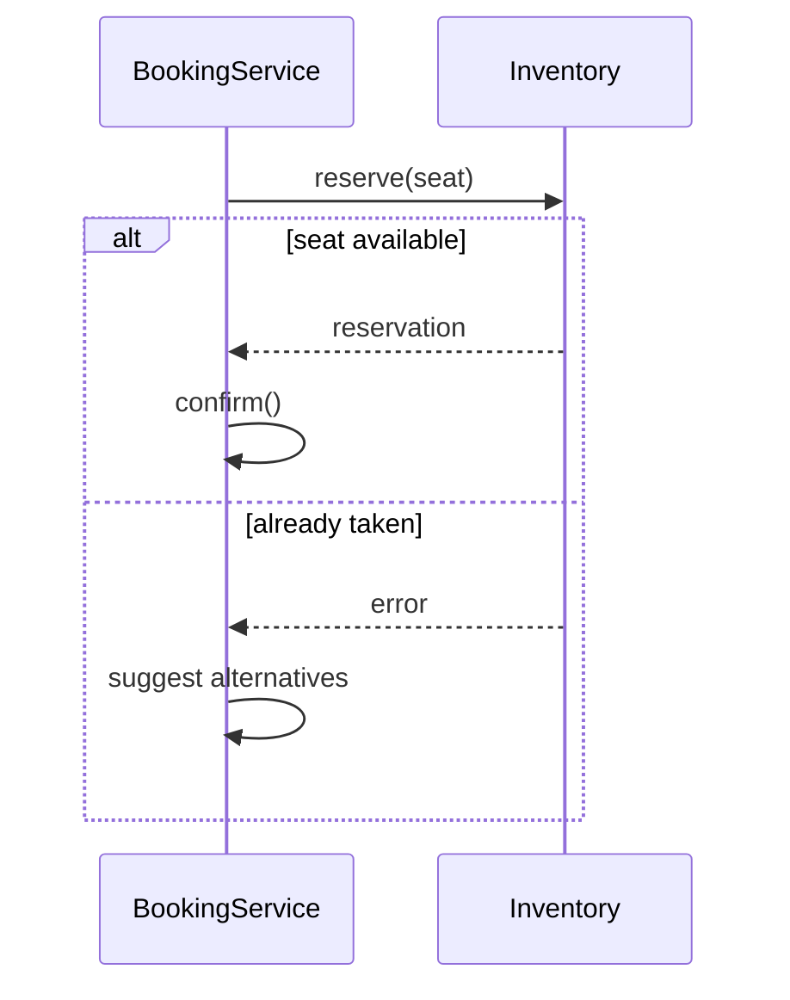

**Why it earns points:** drawing a sequence diagram exposes missing methods instantly. If an arrow has no method to land on, you found a gap in your class diagram before you wrote code. Use it as a design *check*, not decoration.

---

## 4. State diagram — for entities with a lifecycle

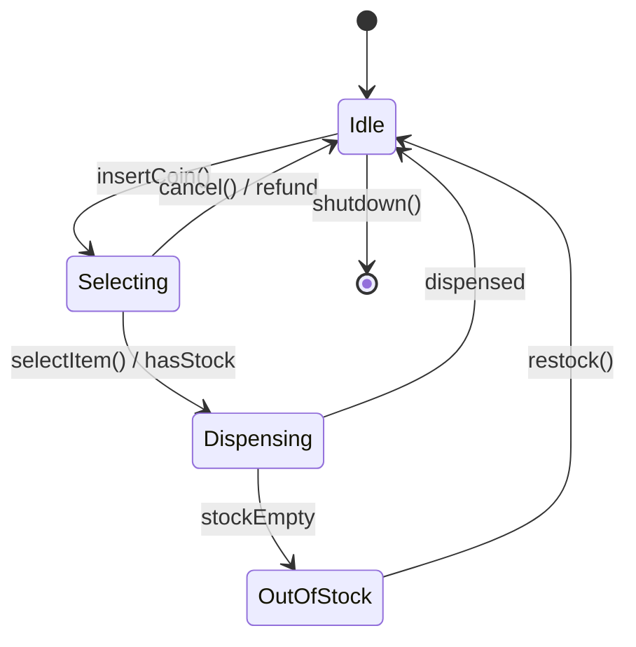

Transitions are labelled `event / guard-or-action`. Anything you can draw as a state diagram maps directly onto the **State pattern** (Module 07) — and the diagram tells you exactly which classes to write: one per state, one method per event.

Entities worth a state diagram: vending machine, elevator, order, parking ticket, ATM session, chess game, ride booking.

---

## 5. Use case diagram — 60 seconds, then move on

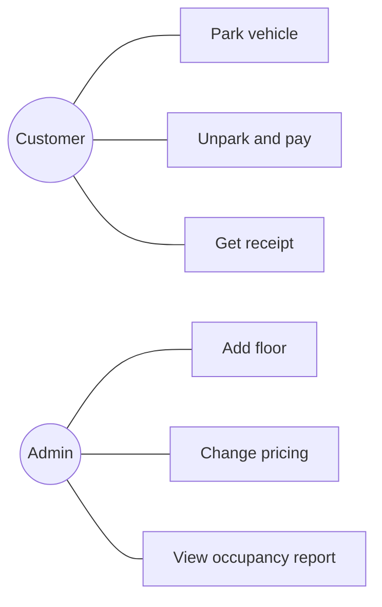

Its only job is the requirement phase: **who are the actors and what does each want to do?** Once you have that list you have your public API surface. Then stop drawing it.

---

## 6. Activity diagram — branching workflows

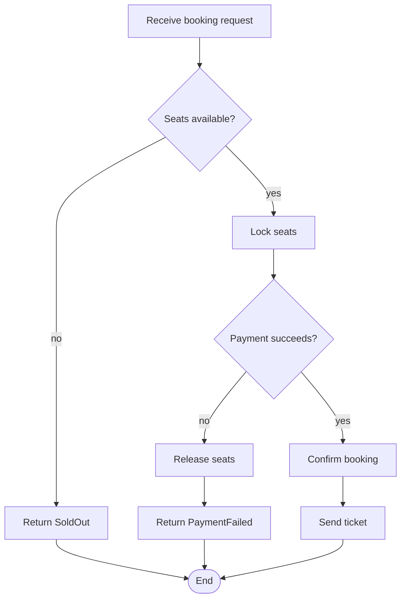

Use it when the *process* is the hard part — especially compensating actions like "release the seats if payment fails". That release step is exactly the kind of thing candidates forget until the diagram makes the gap visible.

---

## 7. From requirements to diagram — the mechanical method

1. **Underline the nouns** in the requirements → candidate classes.
2. **Strike the fake ones**: `System`, `Data`, `Info`, `Manager`, anything that's really an attribute (`name`, `price`).
3. **Underline the verbs** → candidate methods; attach each to the noun that owns the data (Information Expert, Module 03).
4. **Draw the boxes**, 2–4 fields and 2–4 methods each.
5. **Connect them** and label multiplicity. Ask ownership: does the part die with the whole?
6. **Mark the variation points** — anything you expect to change becomes `<<protocol>>`.
7. **Walk one use case as a sequence** and fix the gaps you find.

Worked micro-example:

> "A **customer** can borrow a **copy** of a **book** from the **library** for 14 **days**. A **librarian** can add copies."

Nouns → Customer, Copy, Book, Library, Loan (implied by "borrow for 14 days"), Librarian.
Verbs → borrow (Library or Customer?), add (Library).
`Loan` never appeared as a noun — **implied entities are where the design is**. Finding `Loan`, `Ticket`, `Reservation`, `Session` is what separates a good diagram from a list of the obvious.

---

## 8. Whiteboard tactics

- Draw boxes **top-to-bottom by layer**: domain entities at the top, protocols in the middle, implementations at the bottom.
- Write field names only where they carry a design decision.
- Use a `<<protocol>>` box for every variation point — the interviewer's next question is always "how would you add X?", and the box is your answer.
- Leave space on the right for the sequence diagram.
- Narrate while drawing. A silent 5-minute diagram earns less than a noisy 3-minute one.
- If you run out of time, a correct class diagram plus a stated intent beats a half-drawn everything.

---

## 9. Common mistakes

| Mistake | Fix |
|---|---|
| Every relationship drawn as a plain line | Decide ownership; use the right arrow |
| Inheritance used for "is kind of" that isn't substitutable | Module 02 §L; prefer composition |
| No multiplicity anywhere | Add it; it's where invariants live |
| 20 methods per box | Show the 3 that explain the design |
| No protocols on the diagram | Your design has no extension points |
| Entity classes with only getters/setters | Anemic model (Module 03 §5) |
| A `Manager` box | Name the actual responsibility |
| Drawing a state diagram for a stateless entity | Skip it |

---

## ✅ Checkpoint
1. Draw, from memory, the six relationship notations and give a Swift line for each.
2. Give the one-sentence test that distinguishes aggregation from composition.
3. What does `"1" --> "0..*"` mean, and what Swift type does it become?
4. Name two entities implied by requirements but absent from the nouns.
5. When is a sequence diagram worth the time, and what design bug does it catch?

Then: `EXERCISES.md` → `SOLUTIONS.md` → `PROJECT.md`. (No `swift test` for this module — the deliverables are diagrams.)
