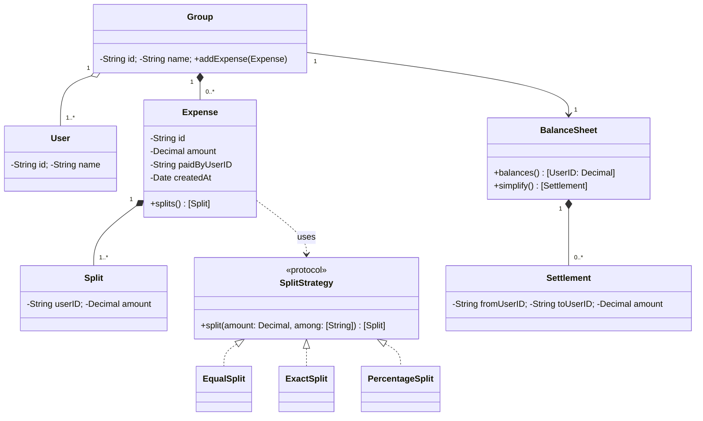
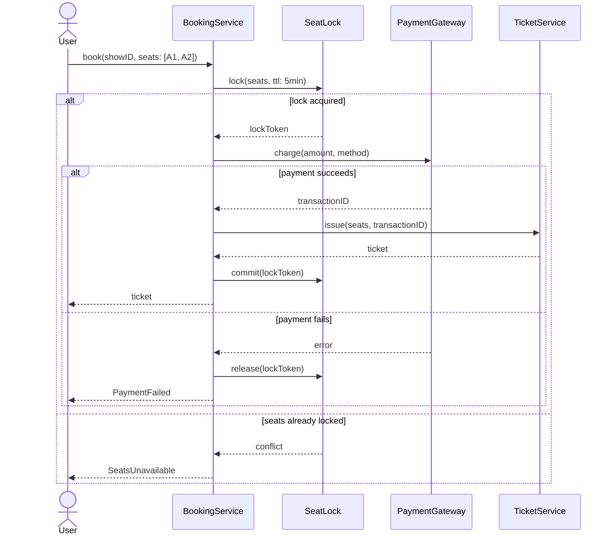
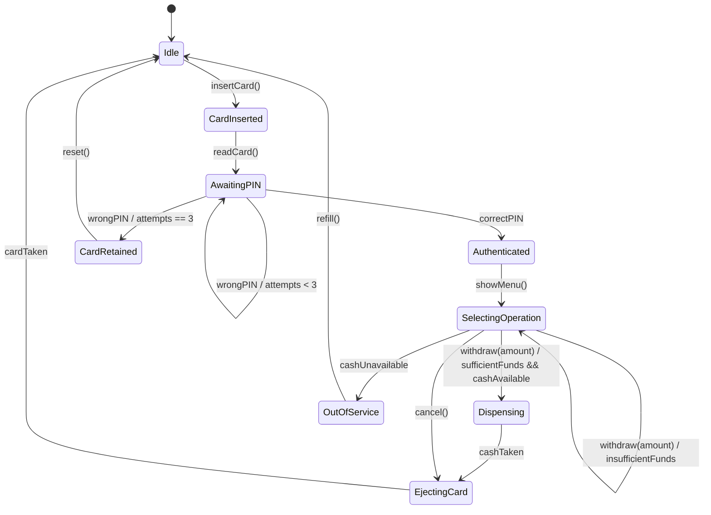
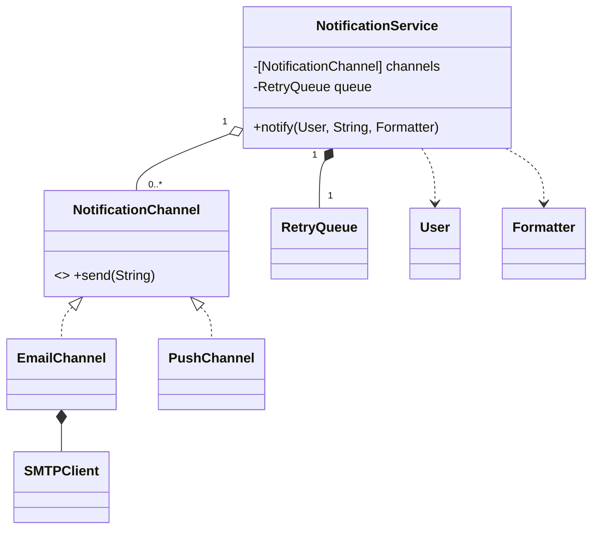

# Module 04 — Solutions

## E1 — Relationships

| # | Pair | Relationship | Mermaid | Swift |
|---|---|---|---|---|
| 1 | Playlist / Song | aggregation | `Playlist o-- Song` | `var songs: [Song]` (shared, outlive the playlist) |
| 2 | Order / OrderLine | composition | `Order *-- OrderLine` | `let lines: [OrderLine]` created with the order |
| 3 | Circle / Shape | realization | `Shape <|.. Circle` | `struct Circle: Shape` |
| 4 | EmailService / Logger | dependency | `EmailService ..> Logger` | `func send(_ m: M, log: Logger)` |
| 5 | Elevator / ElevatorDoor | composition | `Elevator *-- ElevatorDoor` | door has no meaning without the car |
| 6 | SavingsAccount / Account | inheritance | `Account <|-- SavingsAccount` | `class SavingsAccount: Account` |
| 7 | University / Student | aggregation | `University o-- Student` | students exist after graduating |
| 8 | Car / Engine | composition | `Car *-- Engine` | `private let engine = Engine()` |

The recurring test: **destroy the whole — does the part still mean anything?**

## E2 — Multiplicity

| # | Multiplicity | Swift |
|---|---|---|
| 1 | `ParkingSpot "1" --> "0..1" Vehicle` | `var occupant: Vehicle?` |
| 2 | `Board "1" *-- "64" Square` | `let squares: [Square]` + an invariant asserting 64 (or a fixed 8×8 structure) |
| 3 | `User "1" o-- "0..*" Address` plus `User "1" --> "0..1" Address : default` | `var addresses: [Address]`, `var defaultAddressID: String?` |
| 4 | `Show "*" --> "1" Screen` | `let screen: Screen` on Show; the screen doesn't hold shows |
| 5 | `Ride "*" --> "1" Driver`, `Ride "*" --> "1" Rider` | `let driverID: String`, `let riderID: String` |

Note #4 and #5: **owning the reference on the many-side** keeps the one-side free of a growing array. That's a modelling decision the diagram forces you to make.

## E3 — Nouns and verbs

Real entities: `User`, `Restaurant`, `Dish`/`MenuItem`, `Cart`, `CartItem`, `Order`, `OrderItem`, `Payment`, `DeliveryPartner`, `Delivery`/`Assignment`, `Rating`, `Notification`.

**Implied entities** (the valuable ones): `Cart` vs `Order` are different lifecycle stages of the same data; `OrderItem` snapshots price at purchase time (a `Dish` price change must not rewrite history); `Assignment` is the relationship between a partner and an order over time; `Payment` is an entity, not a boolean, because it has status, method and retries.

Fake nouns: "the system" (that's the whole program), "stage" (an attribute of `Order`), "card or wallet" (they're `PaymentMethod` cases, not entities — unless each has distinct behaviour, in which case: protocol).

## E4 — Splitwise class diagram

Decisions the diagram makes visible: splits are **composed** into the expense (delete the expense, the splits are meaningless); users are **aggregated** by the group (a user exists outside every group); the split algorithm is a **protocol** because it's the stated variation axis; `Settlement` is an implied entity nobody mentioned.

The classic mistake here is storing a `balance` on `User`. Balance is **derived** from expenses; storing it creates two sources of truth (DRY, Module 03 §1). Compute it, and cache only if measurement demands it.

## E5 — Booking sequence

The graded detail is `release(lockToken)` on the failure path. Locking without a compensating release (and without a TTL for the crash case) is the single most common omission in booking-system interviews.

## E6 — ATM state diagram

Note `EjectingCard` and `CardRetained` are separate states — the card's fate differs, and so does the hardware action. Collapsing them is how you end up eating a customer's card.

## E7 — Reverse engineering

The three graded distinctions: `channels` is **aggregation** (injected, owned by the caller), `queue` is **composition** (created inside, dies with the service), and `User`/`Formatter` are **dependencies** (parameters, not stored). Getting `queue` and `channels` the same is the common error — and it's exactly the ownership question DIP cares about.

## E8 — Errors in the diagram

1. **`Square --|> Rectangle`** — LSP violation (Module 02 §L). Fix: both realize a `Shape` protocol with a read-only `area`; drop the inheritance.
2. **`Manager *-- Employee : manages`** — composition means the employees die with the manager. "Manages" is an association: `Manager "1" --> "0..*" Employee : manages`. Also, `Manager --|> Employee` *and* `Manager *-- Employee` together is a self-containing hierarchy that usually signals the real model is `Employee` with an optional `managerID`.
3. **`Employee *-- Address`** — an address is a value, typically shared or replaced, not exclusively owned; aggregation or a value-type attribute is right. Also, if `Address` is a `struct`, it's not a relationship at all — it's a field.

Bonus: `Employee --|> Person` and `Manager --|> Employee` is a three-level hierarchy built to share fields. Composition (`Employee` *has* `PersonalDetails`) is almost always the better model, because an employee who becomes a contractor shouldn't require a new class.
