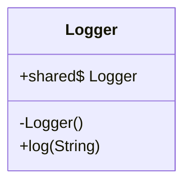
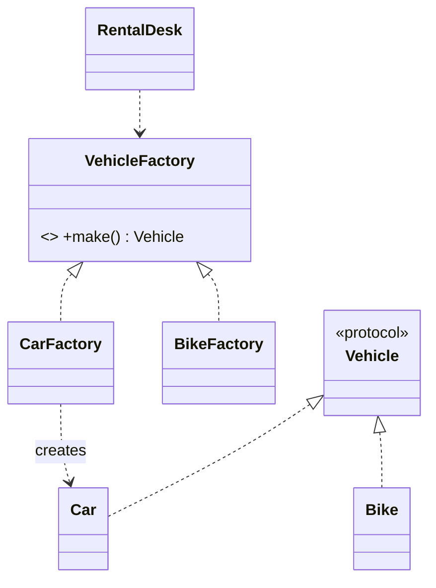
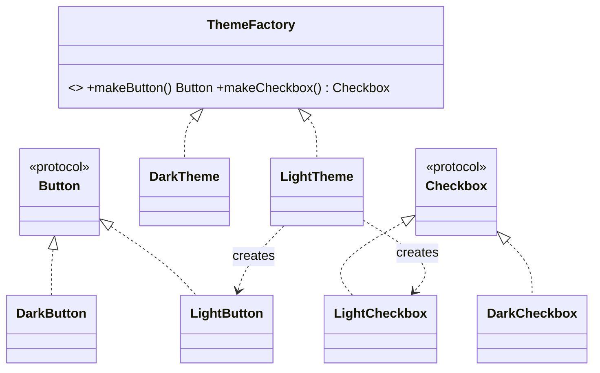

# Module 05 — Creational Patterns

> **Start with [`CONCEPTS.md`](CONCEPTS.md).** It carries the mental models, the intuition and the
> *why* behind everything below — no code. This file is the detailed reference you read second,
> once the ideas have a shape to attach to.

**Goal:** control *how objects come into existence*, so that adding a new kind of object doesn't ripple through the code that uses them.

**The one sentence that unifies them:** every creational pattern exists because `let x = ConcreteThing()` **hardcodes a decision** at the worst possible place — inside the code that just wants to use `x`.

| Pattern | Encapsulates | Use when |
|---|---|---|
| **Singleton** | that there is exactly one instance | genuinely one shared resource, and you've exhausted the alternatives |
| **Factory Method** | *which* subtype to create | one product family, decision varies by context |
| **Abstract Factory** | creating *families* of related products | products must be consistent with each other |
| **Builder** | step-by-step construction of a complex object | many optional parameters, or validation at the end |
| **Prototype** | creating by copying an existing instance | construction is expensive, or you need runtime-configured templates |
| **Object Pool** | reusing expensive instances | creation cost dominates (connections, threads) |
| **Dependency Injection** | *who decides* which implementation | almost always — this is the default, not a fallback |

Read the table in this order: **DI first, patterns after.** Most "I need a factory" moments are actually "I need to inject this".

---

## 1. Singleton

> **Ensure a class has only one instance and provide a global point of access to it.**



### Swift implementation

```swift
final class Logger {
    static let shared = Logger()          // lazy + thread-safe, guaranteed by Swift's `let` statics
    private init() {}                     // the essential half — blocks other instances
    func log(_ message: String) { print(message) }
}
```

Swift gives you the hard part for free: `static let` is initialised lazily and exactly once, with thread safety guaranteed by `swift_once`. **No `dispatch_once`, no double-checked locking, no `@synchronized`.** Say that in an interview — most candidates recite the Java version.

`private init()` is what people forget. Without it, `Logger()` still compiles and you have a "singleton" with N instances.

### Thread safety is about state, not creation
Creation is safe. Mutable state inside is not:

```swift
final class Counter {
    static let shared = Counter()
    private init() {}
    private var count = 0
    func increment() { count += 1 }        // ❌ data race from multiple threads
}
```
Fixes, in order of preference:
```swift
actor Counter {                            // ✅ Swift concurrency (Module 09)
    static let shared = Counter()
    private var count = 0
    func increment() { count += 1 }
}
// or serialise with a lock / private DispatchQueue if you must stay synchronous
```

### Why Singleton is the most criticised pattern
1. **Global mutable state** — the worst kind of coupling (Module 01 §9, "common coupling"). Any code anywhere can mutate it.
2. **Hidden dependencies** — `Logger.shared` inside a method doesn't appear in the initialiser, so you can't tell what a type needs by reading its API.
3. **Untestable** — tests share one instance, leak state between each other, and can't substitute a fake.
4. **Lifetime you don't control** — it lives until process death.
5. It often violates SRP: singletons accumulate responsibilities because they're convenient to reach.

### The standard interview answer
> *"I'd use `static let shared` with a `private init` — Swift makes it thread-safe for free. But I'd also inject it: `init(logger: any Logging = Logger.shared)`. That keeps the convenience at the call site while letting tests pass a fake. A raw singleton reference inside a method body is a hidden dependency."*

```swift
protocol Logging { func log(_ message: String) }
final class Logger: Logging {
    static let shared = Logger()
    private init() {}
    func log(_ message: String) { print(message) }
}

struct CheckoutService {
    private let logger: any Logging
    init(logger: any Logging = Logger.shared) { self.logger = logger }   // ✅ default + injectable
}
```

### Legitimate uses
Genuinely single hardware/OS resources (`UIApplication.shared`, `FileManager.default`), immutable configuration loaded once, and caches whose global-ness is the point. Note that all of these are read-mostly.

---

## 2. Factory Method

> **Define an interface for creating an object, but let the implementer decide which class to instantiate.**

**Problem:** a `switch` that constructs concrete types, spread across your code.
```swift
// ❌ every call site knows every vehicle type
let vehicle: Vehicle
switch type {
case .car: vehicle = Car()
case .bike: vehicle = Bike()
case .truck: vehicle = Truck()
}
```

**Solution — the creation decision lives in one place, behind an abstraction:**

```swift
protocol Vehicle { var wheels: Int { get }; func describe() -> String }
struct Car: Vehicle { let wheels = 4; func describe() -> String { "car" } }
struct Bike: Vehicle { let wheels = 2; func describe() -> String { "bike" } }

protocol VehicleFactory {                       // the "factory method" is `make()`
    func make() -> any Vehicle
}
struct CarFactory: VehicleFactory { func make() -> any Vehicle { Car() } }
struct BikeFactory: VehicleFactory { func make() -> any Vehicle { Bike() } }

struct RentalDesk {
    let factory: any VehicleFactory             // injected: this desk rents whatever it was given
    func rent() -> any Vehicle { factory.make() }
}
```



### The Swift pragmatist's version — Simple Factory
In Swift, a static function on an enum is very often enough, and is *not* a GoF pattern but is the right answer more often than the full one:

```swift
enum VehicleKind { case car, bike, truck }

enum VehicleFactory2 {
    static func make(_ kind: VehicleKind) -> any Vehicle {
        switch kind {
        case .car: Car()
        case .bike: Bike()
        case .truck: Truck()
        }
    }
}
```
The switch still exists, but it exists **once**, and the compiler tells you when a new case appears. If the set of kinds is closed, stop here (Module 03 §2–3). If third parties must add kinds, go to the full Factory Method or a registry:

```swift
final class VehicleRegistry {
    private var makers: [String: () -> any Vehicle] = [:]
    func register(_ key: String, _ maker: @escaping () -> any Vehicle) { makers[key] = maker }
    func make(_ key: String) -> (any Vehicle)? { makers[key]?() }
}
```
A closure registry is the Swift-idiomatic Factory. No protocol, no class per product.

### iOS sightings
`UIStoryboard.instantiateViewController(withIdentifier:)`, `UICollectionViewDiffableDataSource`'s cell provider closure, `URLSessionConfiguration.default/.ephemeral/.background`.

---

## 3. Abstract Factory

> **Provide an interface for creating families of related objects without specifying their concrete classes.**

**The distinguishing requirement: consistency.** A dark-theme button must never appear beside a light-theme checkbox. Factory Method makes one product; Abstract Factory makes a *matched set*.

```swift
protocol Button   { func render() -> String }
protocol Checkbox { func render() -> String }

struct LightButton: Button     { func render() -> String { "light-button" } }
struct LightCheckbox: Checkbox { func render() -> String { "light-checkbox" } }
struct DarkButton: Button      { func render() -> String { "dark-button" } }
struct DarkCheckbox: Checkbox  { func render() -> String { "dark-checkbox" } }

protocol ThemeFactory {                         // the abstract factory
    func makeButton() -> any Button
    func makeCheckbox() -> any Checkbox
}
struct LightTheme: ThemeFactory {
    func makeButton() -> any Button { LightButton() }
    func makeCheckbox() -> any Checkbox { LightCheckbox() }
}
struct DarkTheme: ThemeFactory {
    func makeButton() -> any Button { DarkButton() }
    func makeCheckbox() -> any Checkbox { DarkCheckbox() }
}

struct SettingsScreen {
    let theme: any ThemeFactory
    func render() -> [String] { [theme.makeButton().render(), theme.makeCheckbox().render()] }
}
```



**The tradeoff to state out loud:** adding a new *family* (a `HighContrastTheme`) is cheap — one new type. Adding a new *product* (`Slider`) is expensive — every factory must change. Abstract Factory is open along one axis and closed along the other. If your products change more often than your families, this is the wrong pattern.

**Real uses:** cross-platform UI kits, test vs production infrastructure families (`ProdServices` / `MockServices`), database dialects (connection + query builder + migrator must match).

---

## 4. Builder

> **Separate the construction of a complex object from its representation, so the same process can create different representations.**

Use it for: many optional parameters, invalid intermediate states, validation that can only happen at the end, or a fluent DSL.

```swift
struct HTTPRequest {
    let url: URL
    let method: String
    let headers: [String: String]
    let body: Data?
    let timeout: TimeInterval
    let retries: Int
}

final class HTTPRequestBuilder {
    private var url: URL
    private var method = "GET"
    private var headers: [String: String] = [:]
    private var body: Data?
    private var timeout: TimeInterval = 30
    private var retries = 0

    init(url: URL) { self.url = url }

    @discardableResult func method(_ m: String) -> Self { method = m; return self }
    @discardableResult func header(_ k: String, _ v: String) -> Self { headers[k] = v; return self }
    @discardableResult func body(_ d: Data) -> Self { body = d; return self }
    @discardableResult func timeout(_ t: TimeInterval) -> Self { timeout = t; return self }
    @discardableResult func retries(_ n: Int) -> Self { retries = n; return self }

    enum BuildError: Error { case bodyOnGET, negativeRetries }

    func build() throws -> HTTPRequest {                  // validation happens once, at the end
        if method == "GET", body != nil { throw BuildError.bodyOnGET }
        if retries < 0 { throw BuildError.negativeRetries }
        return HTTPRequest(url: url, method: method, headers: headers,
                           body: body, timeout: timeout, retries: retries)
    }
}

let request = try HTTPRequestBuilder(url: url)
    .method("POST")
    .header("Content-Type", "application/json")
    .body(payload)
    .retries(3)
    .build()
```

### The Swift honesty check
Swift has **default arguments and named parameters**, which kill most of Builder's original motivation:

```swift
let request = HTTPRequest(url: url, method: "POST", headers: ["Content-Type": "application/json"],
                          body: payload, timeout: 30, retries: 3)   // already readable
```

So Builder earns its place in Swift only when:
- **Construction is incremental** — parameters arrive at different times or from different code (a query built across several functions).
- **Cross-field validation** must happen before the object exists (`GET` + body is invalid).
- **Directors** exist: the same build sequence producing different representations.
- You want a **result-builder DSL** — Swift's `@resultBuilder` (`ViewBuilder`, `SwiftUI`, `RegexBuilder`) is Builder as a language feature.

Saying *"in Swift I'd start with default arguments and reach for a Builder when validation spans fields"* is a stronger answer than reciting the Java version.

### Director (the optional half)
```swift
struct RequestDirector {
    func makeJSONPost(url: URL, body: Data) throws -> HTTPRequest {
        try HTTPRequestBuilder(url: url).method("POST")
            .header("Content-Type", "application/json").body(body).build()
    }
}
```
The director owns the *recipe*; the builder owns the *assembly*.

---

## 5. Prototype

> **Create new objects by copying an existing instance rather than constructing from scratch.**

Use when construction is expensive (parsed templates, loaded assets), or when the "template" is configured at runtime and can't be expressed as a class.

```swift
protocol Prototype {
    func clone() -> Self
}

final class DocumentTemplate: Prototype {
    var title: String
    var sections: [String]
    var styles: [String: String]

    init(title: String, sections: [String], styles: [String: String]) {
        self.title = title; self.sections = sections; self.styles = styles
    }
    func clone() -> DocumentTemplate {
        DocumentTemplate(title: title, sections: sections, styles: styles)   // deep enough: values copy
    }
}
```

### The Swift twist that matters
**Swift value types are prototypes for free.** `var copy = original` *is* a clone, with copy-on-write efficiency built in:

```swift
struct DocumentTemplate { var title: String; var sections: [String] }
var draft = masterTemplate          // ← this is Prototype, done
draft.title = "Q3 Report"
```
So in Swift, Prototype is a **reference-type** concern. The interview-worthy point is **deep vs shallow**:

```swift
final class Node { var children: [Node] = [] }
final class Tree {
    var root: Node
    init(root: Node) { self.root = root }
    func shallowCopy() -> Tree { Tree(root: root) }        // ⚠️ shares the same node graph
    func deepCopy() -> Tree { Tree(root: root.deepCopied()) }
}
```
If your clone shares mutable reference-type members, mutating the copy corrupts the original — the exact bug Module 01 §2 warned about, now at object-graph scale.

Foundation's version is `NSCopying` / `copy()`; `NSMutableArray.copy()` is a shallow copy, which surprises people annually.

---

## 6. Object Pool

> **Reuse expensive-to-create objects instead of allocating and destroying them.**

```swift
final class ConnectionPool {
    private var available: [Connection] = []
    private var inUse: Set<ObjectIdentifier> = []
    private let maxSize: Int
    private let make: () -> Connection
    private let lock = NSLock()

    init(maxSize: Int, make: @escaping () -> Connection) { self.maxSize = maxSize; self.make = make }

    func acquire() -> Connection? {
        lock.lock(); defer { lock.unlock() }
        if let c = available.popLast() { inUse.insert(ObjectIdentifier(c)); return c }
        guard inUse.count < maxSize else { return nil }       // exhausted: fail, block, or grow — a design decision
        let c = make(); inUse.insert(ObjectIdentifier(c)); return c
    }

    func release(_ c: Connection) {
        lock.lock(); defer { lock.unlock() }
        guard inUse.remove(ObjectIdentifier(c)) != nil else { return }   // ignore foreign objects
        c.reset()                                                        // ⚠️ the step everyone forgets
        available.append(c)
    }
}
```

The three questions an interviewer will ask:
1. **What happens when the pool is exhausted?** Fail fast, block with a timeout, or grow past max — pick and justify.
2. **How do you reset state on release?** A pooled object carrying the previous user's data is a security bug, not a perf bug.
3. **What if a client never releases?** Leak. Mitigations: `defer`-based scoping, a `withConnection { }` closure API, or a lease timeout.

`UITableView`'s cell reuse queue is the object pool you already use — and `prepareForReuse()` is the reset step, which tells you how central it is.

---

## 7. Dependency Injection (the pattern that replaces most of the above)

Not a GoF pattern, but the most important creational technique in modern code.

```swift
// Creation is separated from use, and moved to the "composition root"
struct AppComposer {
    static func makeCheckoutService() -> CheckoutService {
        CheckoutService(
            gateway: StripeGateway(apiKey: Config.stripeKey),
            store: PostgresOrderStore(pool: .shared),
            logger: Logger.shared,
            clock: SystemClock()
        )
    }
}
```

**Composition root**: exactly one place in the app (`AppDelegate`, `App.init`, a `Composer` type) where concrete types are chosen and wired. Everything below it receives its dependencies and constructs nothing important.

Why this beats a Service Locator (`Container.resolve(Logger.self)`): with injection, a type's dependencies are *visible in its initialiser* and the compiler enforces them. With a locator, dependencies are invisible and failures are runtime.

**Property wrapper DI** is popular in Swift, and it's a service locator in disguise:
```swift
@Injected var logger: any Logging        // convenient, but hides the dependency again
```
Fine for leaf utilities; for domain types, prefer `init`.

---

## 8. Choosing between them

```
Need an object…
├─ …and there must be exactly one shared instance?
│    └─ Is it mutable? → prefer an injected instance owned by the composition root
│       Is it immutable / an OS resource? → Singleton is acceptable
├─ …whose concrete type depends on runtime input?
│    ├─ closed set of kinds? → enum + simple factory function
│    └─ open/extensible set? → Factory Method or a closure registry
├─ …that must match other objects (theme, platform, environment)?
│    └─ Abstract Factory
├─ …with many optional parameters or cross-field validation?
│    ├─ all parameters known at once? → default arguments (no pattern)
│    └─ incremental or validated at the end? → Builder
├─ …that's expensive to construct but cheap to copy?
│    └─ Prototype (value types get this free)
├─ …that's expensive and reusable?
│    └─ Object Pool
└─ …otherwise
     └─ Dependency Injection. This is the default answer.
```

---

## 9. Pitfalls and anti-patterns

| Pitfall | Why it hurts | Fix |
|---|---|---|
| Singleton everywhere ("singleton-itis") | global state, untestable, hidden deps | inject; default the parameter to `.shared` |
| Factory that returns one product | indirection with no payoff (KISS) | call the initialiser |
| Abstract Factory when products change more than families | every new product edits every factory | Factory Method per product, or a registry |
| Builder for 3 parameters | Swift has default arguments | plain init |
| Prototype with a shallow copy of a mutable graph | copy mutates the original | deep copy, or use value types |
| Pool without reset | data leaks across clients | reset on release |
| Service locator called deep inside types | dependencies invisible again | composition root + init injection |
| Factory *and* DI *and* a singleton for the same object | three ways to obtain it, three lifetimes | pick one |

---

## 10. Interview probes and the answers that score

- *"How do you make a thread-safe singleton in Swift?"* → `static let` + `private init`; Swift guarantees once-only, thread-safe initialisation. Then pivot: the risk is mutable state, so use an `actor` or inject it.
- *"Factory Method vs Abstract Factory?"* → one product vs a consistent family; and note Abstract Factory is closed against new products.
- *"When would you not use Builder in Swift?"* → when default arguments express it; Builder earns its place with incremental construction or cross-field validation.
- *"Your factory returns `any Vehicle` — what's the cost?"* → existential boxing and dynamic dispatch; use `some` or generics if the concrete type is known at compile time.
- *"How would you test a type that uses `URLSession.shared`?"* → you can't cleanly; inject a `NetworkFetching` protocol. This is the DIP answer and they're checking you reach for it unprompted.

---

## ✅ Checkpoint
1. Write a thread-safe Swift singleton and then explain why you'd still inject it.
2. Give a requirement where Abstract Factory is right and one where it's wrong.
3. Name three conditions that justify a Builder in Swift.
4. Explain why `var b = a` is Prototype for a struct but not for a class.
5. Name the three questions every object pool design must answer.

Then: `EXERCISES.md` → `swift test --filter M05` → `SOLUTIONS.md` → `PROJECT.md`.
