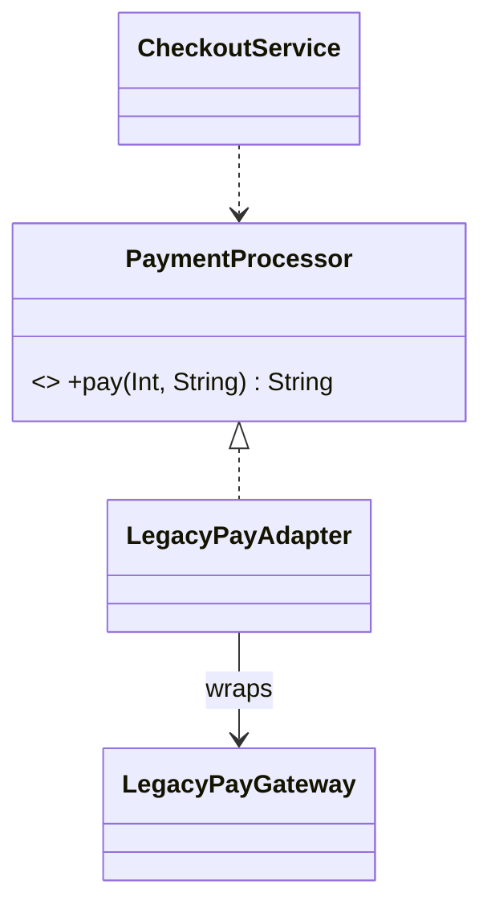
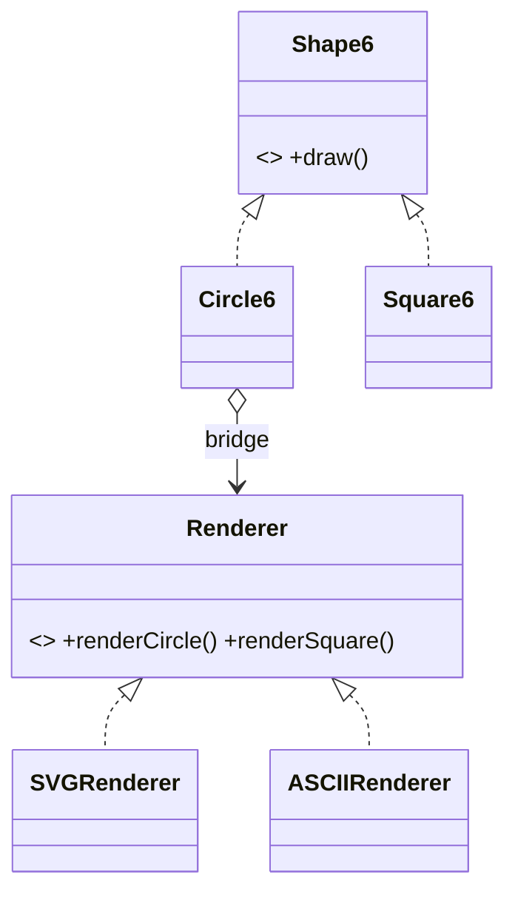
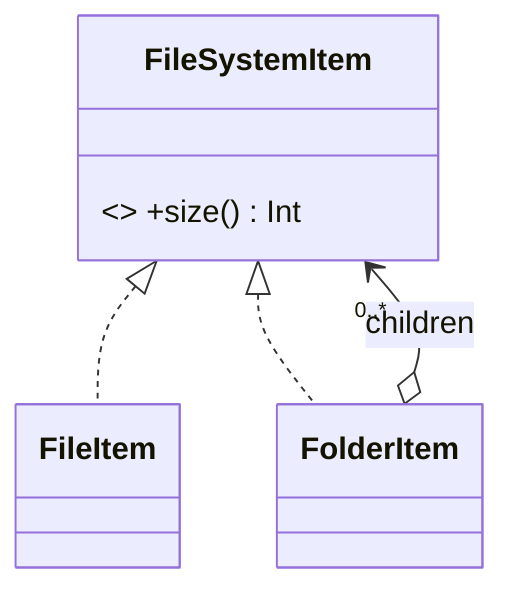
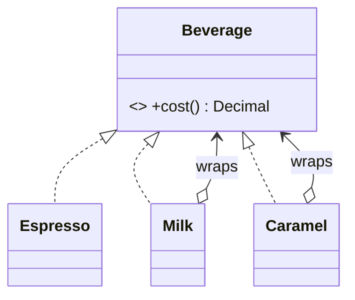

# Module 06 — Structural Patterns

> **Start with [`CONCEPTS.md`](CONCEPTS.md).** It carries the mental models, the intuition and the
> *why* behind everything below — no code. This file is the detailed reference you read second,
> once the ideas have a shape to attach to.

**Goal:** compose objects into larger structures without rigid inheritance — and know which of the seven to reach for, because four of them look identical in a class diagram.

**The unifying idea:** all seven wrap or arrange objects. They differ entirely in **intent**, not in shape. An interviewer testing structural patterns is testing whether you can state intent.

| Pattern | Intent in one line | Wrapper? |
|---|---|---|
| **Adapter** | make an incompatible interface usable | yes — changes the interface |
| **Bridge** | let an abstraction and its implementation vary independently | no — two hierarchies |
| **Composite** | treat a tree of objects like a single object | no — recursive containment |
| **Decorator** | add behaviour at runtime, stackably | yes — keeps the interface |
| **Facade** | give a simple entry point to a complex subsystem | yes — simplifies the interface |
| **Flyweight** | share immutable state across many instances | no — shares state |
| **Proxy** | control access to an object | yes — keeps the interface |

---

## 1. Adapter

> **Convert the interface of a class into another interface clients expect.**

Use when you own the client but **not** the thing you're calling: a third-party SDK, a legacy class, a C API, a server response shape.

```swift
// The interface your domain wants
protocol PaymentProcessor {
    func pay(amountInPaise: Int, orderID: String) throws -> String
}

// The third-party SDK you cannot change
final class LegacyPayGateway {
    func makePayment(_ rupees: Double, ref: String, currency: String) -> [String: Any] {
        ["status": "OK", "txn": "TXN-\(ref)"]
    }
}

// The adapter
struct LegacyPayAdapter: PaymentProcessor {
    private let sdk: LegacyPayGateway
    enum AdapterError: Error { case declined }

    init(sdk: LegacyPayGateway) { self.sdk = sdk }

    func pay(amountInPaise: Int, orderID: String) throws -> String {
        let rupees = Double(amountInPaise) / 100.0                   // unit translation
        let raw = sdk.makePayment(rupees, ref: orderID, currency: "INR")
        guard raw["status"] as? String == "OK",                      // error-model translation
              let txn = raw["txn"] as? String else { throw AdapterError.declined }
        return txn
    }
}
```



**What an adapter really does** — three translations, and naming them scores points:
1. **Shape**: method names and parameter order.
2. **Units/types**: paise ↔ rupees, `[String: Any]` ↔ a typed result.
3. **Error model**: a status string ↔ Swift `throws`.

**Object adapter vs class adapter:** GoF distinguishes composition-based (object) from inheritance-based (class). Swift has no multiple inheritance, so you always write the object adapter. Swift's extra trick — you can adapt with an extension when the shape is close enough:
```swift
extension LegacyPayGateway: PaymentProcessor {       // retroactive conformance
    func pay(amountInPaise: Int, orderID: String) throws -> String { ... }
}
```
Use a separate adapter type when the translation is non-trivial or you don't want the conformance to leak everywhere.

**iOS sightings:** wrapping `URLSession` behind your own `HTTPClient`, mapping API DTOs to domain models (a mapper *is* an adapter), bridging a Combine publisher to `AsyncSequence`.

---

## 2. Bridge

> **Decouple an abstraction from its implementation so the two can vary independently.**

The problem it solves is a **class explosion from two independent dimensions**:

```
Without bridge: Shape × Renderer
  CircleSVG, CircleCanvas, CircleMetal, SquareSVG, SquareCanvas, SquareMetal…  (M × N types)
With bridge:   Shape (M) + Renderer (N)                                         (M + N types)
```

```swift
// Implementation hierarchy
protocol Renderer {
    func renderCircle(radius: Double) -> String
    func renderSquare(side: Double) -> String
}
struct SVGRenderer: Renderer {
    func renderCircle(radius: Double) -> String { "<circle r='\(radius)'/>" }
    func renderSquare(side: Double) -> String { "<rect w='\(side)'/>" }
}
struct ASCIIRenderer: Renderer {
    func renderCircle(radius: Double) -> String { "O(\(radius))" }
    func renderSquare(side: Double) -> String { "[\(side)]" }
}

// Abstraction hierarchy — holds a reference to the implementation (the "bridge")
protocol Shape6 { func draw() -> String }
struct Circle6: Shape6 {
    let radius: Double
    let renderer: any Renderer                    // ← the bridge
    func draw() -> String { renderer.renderCircle(radius: radius) }
}
struct Square6: Shape6 {
    let side: Double
    let renderer: any Renderer
    func draw() -> String { renderer.renderSquare(side: side) }
}
```



**Bridge vs Strategy — the question you will be asked.** The code looks the same: an object holds a protocol and delegates. The difference is intent and scale:
- **Strategy** swaps *one algorithm* inside one class; usually changeable at runtime; the strategy is a detail.
- **Bridge** separates *two whole hierarchies* that each grow; usually chosen at construction; both sides are first-class.

If you can't tell, say so honestly and describe the axis: *"there are two independent dimensions here — shape and renderer — so I'd keep them as separate hierarchies and reference one from the other."* That description is worth more than the label.

**Real uses:** UI toolkit across platforms, a `Notification` (abstraction) over `Channel` (implementation), device drivers, persistence abstraction over storage engines.

---

## 3. Composite

> **Compose objects into tree structures and let clients treat individual objects and compositions uniformly.**

The signature move: the container conforms to the *same protocol* as the leaf.

```swift
protocol FileSystemItem {
    var name: String { get }
    func size() -> Int
    func paths(prefix: String) -> [String]
}

struct FileItem: FileSystemItem {                       // leaf
    let name: String
    let bytes: Int
    func size() -> Int { bytes }
    func paths(prefix: String) -> [String] { ["\(prefix)/\(name)"] }
}

struct FolderItem: FileSystemItem {                     // composite — same protocol
    let name: String
    let children: [any FileSystemItem]
    func size() -> Int { children.reduce(0) { $0 + $1.size() } }      // recursion
    func paths(prefix: String) -> [String] {
        let here = "\(prefix)/\(name)"
        return [here] + children.flatMap { $0.paths(prefix: here) }
    }
}

let tree: any FileSystemItem = FolderItem(name: "src", children: [
    FileItem(name: "main.swift", bytes: 120),
    FolderItem(name: "models", children: [FileItem(name: "User.swift", bytes: 300)]),
])
tree.size()   // 420 — the caller doesn't know or care that this is a tree
```



**The design question interviewers ask:** should `add(child:)` be on the protocol, or only on the composite?
- On the protocol → uniformity (every item looks the same) but leaves must implement a meaningless `add` → **LSP violation** (Module 02 §L).
- On the composite only → type safety, but callers must know which they hold.

GoF chose uniformity; modern practice (and Swift) prefers safety. Say this tradeoff out loud — it's the whole exam question for Composite.

**Where it appears in LLD problems:** file systems, UI view hierarchies, org charts, menu trees, arithmetic expression trees, discounts made of discounts, permissions made of permission groups.

---

## 4. Decorator

> **Attach additional responsibilities to an object dynamically, keeping the same interface.**

The alternative — a subclass per combination — explodes: `CoffeeWithMilk`, `CoffeeWithMilkAndSugar`, `CoffeeWithSoyAndSugarAndCaramel`.

```swift
protocol Beverage {
    var description: String { get }
    func cost() -> Decimal
}

struct Espresso: Beverage {                 // the concrete component
    var description: String { "espresso" }
    func cost() -> Decimal { 120 }
}

// Every decorator wraps a Beverage AND is a Beverage — that's the recursion
struct Milk: Beverage {
    let base: any Beverage
    var description: String { base.description + " + milk" }
    func cost() -> Decimal { base.cost() + 20 }
}
struct Caramel: Beverage {
    let base: any Beverage
    var description: String { base.description + " + caramel" }
    func cost() -> Decimal { base.cost() + 35 }
}

let drink: any Beverage = Caramel(base: Milk(base: Espresso()))
drink.description   // "espresso + milk + caramel"
drink.cost()        // 175
```



Same shape as Composite in the diagram — the difference is **Composite has many children, Decorator has exactly one**, and Decorator's purpose is adding behaviour rather than aggregating.

**The pattern shines beyond pricing.** The most valuable decorator in real code adds *cross-cutting behaviour* without touching the original:

```swift
protocol UserRepository { func user(id: String) async throws -> User }

struct CachingRepository: UserRepository {       // add caching
    let base: any UserRepository
    let cache: Cache
    func user(id: String) async throws -> User {
        if let hit = cache[id] { return hit }
        let u = try await base.user(id: id); cache[id] = u; return u
    }
}
struct LoggingRepository: UserRepository { ... }  // add logging
struct RetryingRepository: UserRepository { ... } // add retries

let repo = LoggingRepository(base: CachingRepository(base: RetryingRepository(base: APIRepository())))
```
Four orthogonal concerns, four small types, composed at the composition root, none of them knowing about the others. This is the single most useful pattern in this module for production iOS code.

**Order matters** — `Caching(Retrying(x))` retries only on cache misses; `Retrying(Caching(x))` may retry the cache lookup. Be ready to discuss it.

---

## 5. Facade

> **Provide a unified, simpler interface to a set of interfaces in a subsystem.**

```swift
// Subsystem: four types, each fine on its own, painful together
struct VideoDecoder { func decode(_ file: String) -> [Frame] { [] } }
struct AudioExtractor { func extract(_ file: String) -> AudioTrack { .init() } }
struct Transcoder { func transcode(_ frames: [Frame], to format: String) -> Data { Data() } }
struct Muxer { func mux(_ video: Data, _ audio: AudioTrack) -> Data { Data() } }

// Facade: one call for the 95% use case
struct MediaConverter {
    private let decoder = VideoDecoder()
    private let audio = AudioExtractor()
    private let transcoder = Transcoder()
    private let muxer = Muxer()

    func convert(file: String, to format: String) -> Data {
        let frames = decoder.decode(file)
        let track = audio.extract(file)
        let video = transcoder.transcode(frames, to: format)
        return muxer.mux(video, track)
    }
}
```

Rules that keep a facade from becoming a God Object:
- A facade **delegates**; it does not implement business rules.
- It must not be the *only* way in — advanced callers can still use the subsystem directly.
- If it grows past ~7 methods, it's becoming the subsystem's God Object; split by use case.

**Facade vs Adapter:** adapter changes an interface to match one a client already requires (shape driven by the client); facade invents a *simpler* interface (shape driven by convenience). Adapter usually wraps one thing; facade wraps several.

**iOS examples:** a `SessionManager` hiding keychain + token refresh + networking; `UIImagePickerController` over camera/photo APIs; your app's `AnalyticsService` hiding three SDKs.

---

## 6. Flyweight

> **Share common immutable state between many objects to reduce memory.**

Split state in two:
- **Intrinsic** — shared, immutable, stored once (a glyph's shape, a tree species' texture, a chess piece's movement rules).
- **Extrinsic** — unique per instance, passed in (position, colour, owner).

```swift
// Intrinsic: one instance per piece kind, shared by every piece of that kind
final class PieceType {
    let name: String
    let moveRules: String
    init(name: String, moveRules: String) { self.name = name; self.moveRules = moveRules }
}

enum PieceTypeFactory {                                     // the flyweight factory
    nonisolated(unsafe) private static var cache: [String: PieceType] = [:]
    static func type(_ name: String, rules: String) -> PieceType {
        if let hit = cache[name] { return hit }
        let made = PieceType(name: name, moveRules: rules)
        cache[name] = made
        return made
    }
}

// Extrinsic: tiny per-instance state
struct Piece {
    let type: PieceType          // shared reference
    var square: String           // unique
    var isWhite: Bool            // unique
}
```
32 chess pieces, 6 `PieceType` objects. At the scale that matters — a million particles, a text editor's glyphs, map tiles — the saving is the difference between shipping and not.

**Requirements for correctness:** the shared state must be **immutable** (or you've created invisible global mutable state), and the factory must be **thread-safe**.

**Be honest about relevance:** in most LLD interview problems, Flyweight is a *memory optimisation you mention*, not one you implement. Saying *"if we had millions of these, I'd make the rules a flyweight and keep only position per instance"* is the right depth. Implementing it for 32 chess pieces is over-engineering.

Swift's string interning and copy-on-write are flyweight-like mechanisms already in the language.

---

## 7. Proxy

> **Provide a surrogate for another object to control access to it.**

Same interface as the real thing (unlike Adapter), no added user-facing behaviour (unlike Decorator) — the point is **control**.

Four classic kinds:

```swift
protocol Image { func data() -> Data }

// 1. VIRTUAL proxy — defer expensive creation
final class LazyImage: Image {
    private let path: String
    private var loaded: RealImage?
    init(path: String) { self.path = path }
    func data() -> Data {
        if loaded == nil { loaded = RealImage(path: path) }     // load on first use
        return loaded!.data()
    }
}

// 2. PROTECTION proxy — access control
struct SecureDocument: Document {
    let base: any Document
    let currentUserRole: Role
    func contents() throws -> String {
        guard currentUserRole == .admin else { throw AccessError.forbidden }
        return try base.contents()
    }
}

// 3. REMOTE proxy — local stand-in for something elsewhere (an API client is one)
// 4. SMART proxy — reference counting, logging, lazy caching of results
```

**Proxy vs Decorator vs Adapter — memorise this:**

| | Interface | Purpose | Typical count |
|---|---|---|---|
| **Adapter** | **changes** it | make incompatible things work together | one |
| **Decorator** | **keeps** it | add behaviour, stackable | many, nested |
| **Proxy** | **keeps** it | control access/lifecycle | usually one |

Rule of thumb: if the wrapper adds *features the caller wants*, it's a Decorator. If it adds *restrictions or lifecycle management the caller doesn't ask for*, it's a Proxy. If the caller couldn't call the wrapped thing at all without it, it's an Adapter.

**iOS sightings:** `lazy var` is a language-level virtual proxy; `NSProxy`; SwiftUI's `@StateObject` wrapper semantics; an API client standing in for a server.

---

## 8. Choosing among the seven

```
I have an object and I want to…
├─ …use it, but its interface is wrong          → Adapter
├─ …add behaviour without touching it           → Decorator
├─ …control when/whether it's reachable         → Proxy
├─ …hide several of them behind one simple call → Facade
├─ …treat one and many identically              → Composite
├─ …vary two dimensions independently           → Bridge
└─ …have a million of them cheaply              → Flyweight
```

**The four-wrapper disambiguation, in interview language:**
> *"Adapter changes the interface, Decorator adds behaviour behind the same interface, Proxy controls access behind the same interface, and Facade introduces a new simpler interface over several objects."*

---

## 9. Pitfalls

| Pitfall | Why | Fix |
|---|---|---|
| Decorator chain 6 deep | debugging becomes archaeology | cap the stack; name the composed type |
| Facade that owns business rules | becomes a God Object (SRP) | delegate only |
| Composite with `add` on leaves | LSP violation | put `add` on the composite type |
| Adapter that also adds features | two responsibilities | separate adapter from decorator |
| Flyweight with mutable shared state | hidden global mutable state | make intrinsic state immutable |
| Bridge where a single hierarchy suffices | needless indirection (KISS) | only for two real dimensions |
| Proxy that silently swallows errors | invisible failure | propagate or log explicitly |

---

## 10. Interview probes

- *"Decorator vs Proxy?"* → interface identical in both; decorator adds capability the caller wants, proxy controls access; decorators stack, proxies usually don't.
- *"Adapter vs Facade?"* → adapter conforms to an interface the client already demands; facade invents a simpler one.
- *"Composite: where do you put `add`?"* → on the composite, to preserve LSP; discuss the uniformity tradeoff.
- *"Bridge vs Strategy?"* → two hierarchies varying independently vs one swappable algorithm.
- *"How would you add caching to this repository?"* → a decorator, chosen at the composition root, zero edits to the original. This is the highest-frequency real-world structural question.

---

## ✅ Checkpoint
1. State each of the seven intents in one sentence, without examples.
2. Explain the difference between Adapter, Decorator, Proxy and Facade to someone who has seen only the class diagram.
3. Give a case where Composite's uniform `add` is a genuine LSP violation.
4. Why must flyweight intrinsic state be immutable?
5. Give an ordering of `Caching`, `Logging` and `Retrying` decorators and explain what changes if you reverse two of them.

Then: `EXERCISES.md` → `swift test --filter M06` → `SOLUTIONS.md` → `PROJECT.md`.
