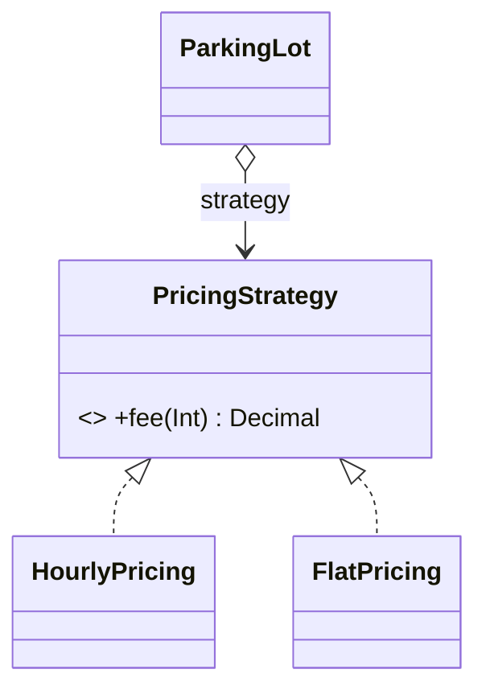
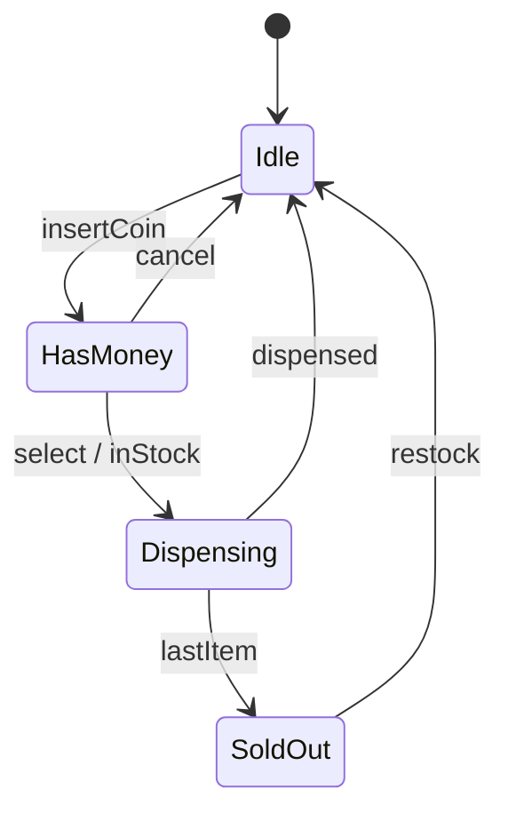

# Module 07 — Behavioral Patterns

> **Start with [`CONCEPTS.md`](CONCEPTS.md).** It carries the mental models, the intuition and the
> *why* behind everything below — no code. This file is the detailed reference you read second,
> once the ideas have a shape to attach to.

**Goal:** control how objects *communicate* and how *responsibility* moves between them. These are the patterns that show up most in LLD interviews, because almost every problem has a "behaviour that varies" at its core.

| Pattern | Intent | Trigger phrase in a requirement |
|---|---|---|
| **Strategy** | swap an algorithm | "…can be calculated in different ways" |
| **State** | behaviour changes with internal state | "…when the machine is idle / dispensing / out of stock" |
| **Observer** | notify many dependents of a change | "…everyone subscribed should be told" |
| **Command** | turn a request into an object | "…support undo / queue / schedule / log actions" |
| **Chain of Responsibility** | pass a request along handlers | "…try A, then B, then C until one handles it" |
| **Template Method** | fixed skeleton, variable steps | "…the process is always these 5 steps, but step 3 differs" |
| **Iterator** | traverse without exposing internals | "…iterate over the collection" |
| **Mediator** | centralise many-to-many communication | "…these N components all talk to each other" |
| **Memento** | capture and restore state | "…snapshot / checkpoint / restore" |
| **Visitor** | add operations to a type hierarchy | "…new operations over a stable set of types" |
| **Null Object** | a do-nothing default | "…optional dependency, absent by default" |

---

## 1. Strategy ⭐ the highest-value pattern in this module

> **Define a family of algorithms, encapsulate each, and make them interchangeable.**

```swift
protocol PricingStrategy {
    var name: String { get }
    func fee(hours: Int) -> Decimal
}
struct HourlyPricing: PricingStrategy {
    let rate: Decimal
    var name: String { "hourly" }
    func fee(hours: Int) -> Decimal { Decimal(hours) * rate }
}
struct FlatPricing: PricingStrategy {
    let amount: Decimal
    var name: String { "flat" }
    func fee(hours: Int) -> Decimal { amount }
}
struct DayNightPricing: PricingStrategy { ... }

final class ParkingLot {
    private var pricing: any PricingStrategy
    init(pricing: any PricingStrategy) { self.pricing = pricing }
    func setPricing(_ p: any PricingStrategy) { pricing = p }        // swappable at runtime
    func charge(hours: Int) -> Decimal { pricing.fee(hours: hours) }
}
```



**The Swift version you should mention:** a strategy with one method is a **closure**.
```swift
typealias PricingStrategy = (Int) -> Decimal
let hourly: PricingStrategy = { Decimal($0) * 50 }
```
Use the protocol when the strategy needs a name, several methods, stored configuration, or equality/persistence. Use a closure when it's genuinely one function. `Array.sorted(by:)` is Strategy as a closure, and you use it every day.

**Strategy vs State:** the code is nearly identical; the *intent* differs.
- Strategy: the **client** chooses, and the choice is usually stable for the object's life.
- State: the **object** transitions itself, and the states know about each other.

**Strategy vs Bridge:** one algorithm vs two hierarchies (Module 06 §2).

---

## 2. State

> **Let an object alter its behaviour when its internal state changes. The object appears to change its class.**

The smell it kills: a method that is one huge `switch` over a `status` field, repeated in every method.

```swift
// ❌ every method repeats the same switch
final class VendingMachineBad {
    enum Status { case idle, hasMoney, dispensing, soldOut }
    var status: Status = .idle
    func insertCoin() { switch status { case .idle: ...; case .hasMoney: ...; ... } }
    func select(_ item: String) { switch status { ... } }
    func dispense() { switch status { ... } }
}
```

```swift
// ✅ one type per state; each knows only its own transitions
protocol VendingState {
    var name: String { get }
    func insertCoin(_ machine: VendingMachine) -> String
    func select(_ item: String, _ machine: VendingMachine) -> String
    func dispense(_ machine: VendingMachine) -> String
}

final class VendingMachine {
    private(set) var state: any VendingState
    private(set) var stock: Int
    init(stock: Int) { self.stock = stock; self.state = IdleState() }

    func transition(to next: any VendingState) { state = next }
    func decrementStock() { stock -= 1 }

    func insertCoin() -> String { state.insertCoin(self) }
    func select(_ item: String) -> String { state.select(item, self) }
    func dispense() -> String { state.dispense(self) }
}

struct IdleState: VendingState {
    var name: String { "idle" }
    func insertCoin(_ m: VendingMachine) -> String { m.transition(to: HasMoneyState()); return "coin accepted" }
    func select(_ item: String, _ m: VendingMachine) -> String { "insert a coin first" }
    func dispense(_ m: VendingMachine) -> String { "nothing to dispense" }
}
struct HasMoneyState: VendingState { ... }
```



**Why this beats the switch:** each state's rules live in one place; an invalid transition is handled by the state that owns it; adding a state is a new file. The cost is N small types and the indirection of `machine.transition(to:)`.

**Swift alternative worth naming:** an `enum` with associated values plus a single `transition(on: Event)` function is a compact, exhaustive state machine, and often better for small machines:
```swift
enum MachineState { case idle, hasMoney(Int), dispensing(item: String), soldOut }
func next(_ state: MachineState, _ event: Event) -> MachineState { ... }   // one exhaustive switch
```
Rule: **few states with simple logic → enum. Many states with rich per-state behaviour → State pattern.** Saying which you'd pick and why is the interview answer.

Problems where State is the right call: vending machine, ATM, elevator, order lifecycle, TCP connection, media player, game turn phases.

---

## 3. Observer ⭐

> **Define a one-to-many dependency so that when one object changes state, all its dependents are notified automatically.**

```swift
protocol StockObserver: AnyObject {
    var id: String { get }
    func priceChanged(symbol: String, price: Decimal)
}

final class StockTicker {
    private var observers: [ObjectIdentifier: WeakBox] = [:]   // weak, to avoid retain cycles

    func subscribe(_ o: any StockObserver) { observers[ObjectIdentifier(o)] = WeakBox(o) }
    func unsubscribe(_ o: any StockObserver) { observers[ObjectIdentifier(o)] = nil }

    func update(symbol: String, price: Decimal) {
        observers.values.compactMap(\.value).forEach { $0.priceChanged(symbol: symbol, price: price) }
    }
}
```

The three things interviewers check:
1. **Memory** — observers must be held `weak`, or you leak. (`NotificationCenter` used to be the classic leak source.)
2. **Unsubscription** — there must be a way out, and it must be safe to call during notification.
3. **Ordering and re-entrancy** — is notification order guaranteed? What if an observer subscribes/unsubscribes *while* being notified? (Answer: iterate over a snapshot.)

**Swift-native equivalents** — say these, and say when the classic pattern still wins:
| Mechanism | Use when |
|---|---|
| `Combine` `Publisher`/`@Published` | reactive chains, iOS 13+, you want operators |
| `AsyncStream` / `AsyncSequence` | structured concurrency, backpressure |
| `NotificationCenter` | app-wide, untyped, loose coupling (and easy to abuse) |
| delegate (`weak var delegate`) | exactly **one** observer |
| closure callbacks | one-shot, local |
| hand-rolled Observer | LLD interviews, no framework dependency, multi-observer |

**Push vs pull:** push sends the data (`priceChanged(symbol:price:)`); pull sends only a signal and observers query back (`didChange(sender:)`). Push is simpler; pull avoids sending data observers don't need. Mention the choice.

---

## 4. Command

> **Encapsulate a request as an object, letting you parameterise, queue, log, and undo operations.**

```swift
protocol Command {
    var describe: String { get }
    func execute()
    func undo()
}

final class TextDocument { var text = "" }

struct AppendCommand: Command {
    let doc: TextDocument
    let addition: String
    var describe: String { "append '\(addition)'" }
    func execute() { doc.text += addition }
    func undo() { doc.text.removeLast(addition.count) }
}

final class CommandHistory {
    private var undoStack: [any Command] = []
    private var redoStack: [any Command] = []

    func run(_ c: any Command) { c.execute(); undoStack.append(c); redoStack.removeAll() }
    func undo() { guard let c = undoStack.popLast() else { return }; c.undo(); redoStack.append(c) }
    func redo() { guard let c = redoStack.popLast() else { return }; c.execute(); undoStack.append(c) }
}
```

Note `redoStack.removeAll()` on a new command — the detail that separates a working undo system from a broken one.

**What Command buys you beyond undo:** queueing, scheduling, retrying, logging/audit trails, macro commands (a command containing commands — that's Composite), transactional rollback, and remote execution (serialise the command, send it).

**Command vs Memento for undo:** Command stores *how to reverse* an operation (cheap, but every command must be reversible). Memento stores *the state before* (always works, but can be expensive). Real editors use both: commands for typing, snapshots every N operations.

**iOS:** `UndoManager`, `UIAction`, target/action, `Operation`/`OperationQueue`.

---

## 5. Chain of Responsibility

> **Pass a request along a chain of handlers until one handles it.**

```swift
protocol Approver: AnyObject {
    var next: (any Approver)? { get set }
    func approve(amount: Decimal) -> String
}

extension Approver {
    func passOn(_ amount: Decimal) -> String {
        next?.approve(amount: amount) ?? "no one can approve \(amount)"
    }
}

final class TeamLead: Approver {
    var next: (any Approver)?
    func approve(amount: Decimal) -> String {
        amount <= 10_000 ? "TeamLead approved \(amount)" : passOn(amount)
    }
}
final class Manager: Approver { ... }     // <= 100_000
final class Director: Approver { ... }    // <= 1_000_000
```

Two flavours, and you should name which you're building:
- **Stop at the first handler** (approval, exception handling) — the classic.
- **Every handler runs** (middleware pipelines, request filters, `UIResponder` chain until handled).

Design questions: what if nobody handles it — default, error, or silence? Can a handler *modify* the request before passing it on? Is the chain built once or per request?

**Examples:** approval hierarchies, middleware (auth → rate-limit → log → route), event bubbling in a view hierarchy, logging levels, ATM cash dispensing by denomination.

---

## 6. Template Method

> **Define the skeleton of an algorithm in a base, deferring some steps to subclasses.**

```swift
class DataImporter {
    final func run(_ path: String) -> String {              // the skeleton — FINAL on purpose
        let raw = read(path)
        let rows = parse(raw)
        let clean = validate(rows)
        return save(clean)
    }
    func read(_ path: String) -> String { "raw:\(path)" }    // shared default
    func parse(_ raw: String) -> [String] { fatalError("subclass must override") }  // required step
    func validate(_ rows: [String]) -> [String] { rows.filter { !$0.isEmpty } }     // overridable hook
    func save(_ rows: [String]) -> String { "saved \(rows.count)" }
}

final class CSVImporter: DataImporter {
    override func parse(_ raw: String) -> [String] { raw.split(separator: ",").map(String.init) }
}
```

Swift's protocol-extension form — usually better, because it works with structs:
```swift
protocol Importer {
    func parse(_ raw: String) -> [String]          // required step
    func validate(_ rows: [String]) -> [String]    // has a default
}
extension Importer {
    func validate(_ rows: [String]) -> [String] { rows.filter { !$0.isEmpty } }
    func run(_ path: String) -> String {            // the template
        save(validate(parse(read(path))))
    }
    func read(_ path: String) -> String { "raw:\(path)" }
    func save(_ rows: [String]) -> String { "saved \(rows.count)" }
}
```
Remember the dispatch rule from Module 01 §7: **anything a conformer must be able to override goes in the protocol body**, not only the extension.

**Template Method vs Strategy:** inheritance vs composition; compile-time vs runtime; one varying *step inside* a fixed algorithm vs the *whole* algorithm swapped. Template Method is the Hollywood Principle in its purest form.

---

## 7. Iterator

> **Access the elements of an aggregate sequentially without exposing its representation.**

Swift has this at the language level — conform to `Sequence` and you get `for-in`, `map`, `filter`, `lazy`, and a hundred more for free:

```swift
struct Playlist: Sequence {
    private let songs: [String]
    init(_ songs: [String]) { self.songs = songs }
    func makeIterator() -> IndexingIterator<[String]> { songs.makeIterator() }
}

// Custom traversal order — here's where you actually write one
struct ShuffledPlaylist: Sequence {
    let songs: [String]
    func makeIterator() -> AnyIterator<String> {
        var remaining = songs.shuffled()
        return AnyIterator { remaining.popLast() }
    }
}

// A tree with two different traversals — the real use of Iterator in LLD
extension TreeNode {
    func breadthFirst() -> AnySequence<TreeNode> {
        AnySequence { () -> AnyIterator<TreeNode> in
            var queue = [self]
            return AnyIterator {
                guard !queue.isEmpty else { return nil }
                let node = queue.removeFirst()
                queue.append(contentsOf: node.children)
                return node
            }
        }
    }
}
```

**The interview point:** the pattern's value is that *multiple traversal orders* can coexist without the collection exposing its storage, and callers can iterate lazily/infinitely. In Swift, say "I'd conform to `Sequence`" — reimplementing `next()` by hand when `IteratorProtocol` exists is a red flag.

`AsyncSequence` is the async iterator, and it's how you'd model a paginated API.

---

## 8. Mediator

> **Define an object that encapsulates how a set of objects interact, so they don't refer to each other directly.**

N components talking directly = N² couplings. Route through a mediator = N couplings.

```swift
protocol ChatMediator: AnyObject {
    func send(_ message: String, from sender: User7)
    func register(_ user: User7)
}

final class ChatRoom: ChatMediator {
    private var users: [User7] = []
    func register(_ user: User7) { users.append(user); user.room = self }
    func send(_ message: String, from sender: User7) {
        users.filter { $0 !== sender }.forEach { $0.receive(message, from: sender.name) }
    }
}

final class User7 {
    let name: String
    weak var room: (any ChatMediator)?
    private(set) var inbox: [String] = []
    init(name: String) { self.name = name }
    func send(_ m: String) { room?.send(m, from: self) }
    func receive(_ m: String, from: String) { inbox.append("\(from): \(m)") }
}
```

**Mediator vs Observer:** Observer is one-to-many broadcast with the subject unaware of who listens. Mediator is many-to-many *coordination* with knowledge of the participants and often of the rules between them ("if the country dropdown changes, clear the city dropdown and disable submit").

**The risk:** the mediator becomes a God Object holding everyone's rules. Keep it to *coordination*, not business logic. `UIViewController` coordinating its subviews is a mediator — and its tendency to bloat is exactly this risk.

---

## 9. Memento

> **Capture an object's internal state so it can be restored later, without violating encapsulation.**

```swift
struct EditorMemento {                       // opaque to everyone but the originator
    fileprivate let text: String
    fileprivate let cursor: Int
}

final class Editor {
    private(set) var text = ""
    private(set) var cursor = 0

    func type(_ s: String) { text += s; cursor = text.count }
    func save() -> EditorMemento { EditorMemento(text: text, cursor: cursor) }
    func restore(_ m: EditorMemento) { text = m.text; cursor = m.cursor }
}

final class Caretaker {                      // holds mementos, can't read them
    private var snapshots: [EditorMemento] = []
    func backup(_ e: Editor) { snapshots.append(e.save()) }
    func undo(_ e: Editor) { guard let m = snapshots.popLast() else { return }; e.restore(m) }
}
```

The three roles: **Originator** (creates/restores), **Memento** (opaque state), **Caretaker** (stores, never inspects). `fileprivate` members are Swift's way of keeping the memento opaque — in Swift a nested type plus `private` also works.

**Cost:** memory. Full snapshots of a large document per keystroke is unacceptable — hence diff-based mementos, or Command for fine-grained operations with periodic snapshots.

---

## 10. Visitor

> **Represent an operation to be performed on the elements of an object structure, letting you define new operations without changing the element classes.**

```swift
protocol ShapeVisitor {
    func visit(_ c: VCircle) -> String
    func visit(_ r: VRect) -> String
}
protocol VisitableShape { func accept(_ v: any ShapeVisitor) -> String }

struct VCircle: VisitableShape {
    let r: Double
    func accept(_ v: any ShapeVisitor) -> String { v.visit(self) }   // "double dispatch"
}
struct VRect: VisitableShape {
    let w, h: Double
    func accept(_ v: any ShapeVisitor) -> String { v.visit(self) }
}

struct AreaVisitor: ShapeVisitor {          // a NEW operation, zero edits to the shapes
    func visit(_ c: VCircle) -> String { "area \(Double.pi * c.r * c.r)" }
    func visit(_ r: VRect) -> String { "area \(r.w * r.h)" }
}
struct SVGVisitor: ShapeVisitor { ... }     // another new operation
```

**The tradeoff, which is the whole exam question:** Visitor makes **new operations** cheap and **new element types** expensive (every visitor must change). It's the exact mirror of ordinary polymorphism, which makes new types cheap and new operations expensive. Choose by asking: *which axis changes more — the types, or the operations over them?*

Use it when the type hierarchy is **stable** and operations keep arriving: AST compilation passes, document export formats, tax rules over a fixed set of account types.

**Swift honesty:** Swift has pattern matching with associated values, so a `switch` over an `enum` gives you the same "new operation, no edits to the types" property with far less ceremony:
```swift
enum VShape { case circle(r: Double), rect(w: Double, h: Double) }
func area(_ s: VShape) -> Double { switch s { case .circle(let r): .pi*r*r; case .rect(let w, let h): w*h } }
```
Say this. "In Swift I'd usually reach for an enum and exhaustive switches rather than classic Visitor, unless the element set must be open to other modules" is a strong answer.

---

## 11. Null Object

> **Provide an object with neutral ("do nothing") behaviour instead of a nil reference.**

```swift
protocol Analytics { func track(_ event: String) }
struct FirebaseAnalytics: Analytics { func track(_ e: String) { /* … */ } }
struct NoOpAnalytics: Analytics { func track(_ e: String) {} }       // the null object

struct CheckoutService7 {
    let analytics: any Analytics
    init(analytics: any Analytics = NoOpAnalytics()) { self.analytics = analytics }
    func checkout() { analytics.track("checkout_started") }          // no `if let` anywhere
}
```
Removes optional-checking from every call site and makes tests trivial. Don't use it where absence is *meaningful* and must be handled — silently doing nothing can hide bugs.

---

## 12. Choosing among them

```
The requirement says…
├─ "…can be computed in several ways"                 → Strategy
├─ "…behaves differently depending on its status"     → State
├─ "…notify everyone interested"                      → Observer
├─ "…undo / redo / queue / schedule / audit"          → Command (+ Memento for snapshots)
├─ "…try handlers until one succeeds"                 → Chain of Responsibility
├─ "…same steps every time, one step differs"         → Template Method
├─ "…iterate / traverse in several orders"            → Iterator (Sequence)
├─ "…these components all talk to each other"         → Mediator
├─ "…snapshot and restore"                            → Memento
├─ "…keep adding new operations over fixed types"     → Visitor (or an enum + switch)
└─ "…this dependency is optional"                     → Null Object
```

### The three confusion pairs, resolved
| Pair | The difference |
|---|---|
| **Strategy vs State** | client picks vs object transitions itself; states know each other, strategies don't |
| **Observer vs Mediator** | broadcast to unknown listeners vs coordination among known participants |
| **Command vs Strategy** | a request to *do* something (with when/undo/queue) vs *how* to do something |

---

## 13. Pitfalls

| Pitfall | Why | Fix |
|---|---|---|
| Observer with strong references | retain cycles / leaks | weak boxes, explicit unsubscribe |
| Notifying while an observer mutates the list | crash or missed observer | iterate a snapshot |
| State classes that new-up each other everywhere | transition logic scattered | keep transitions in states, storage in the context |
| Command without clearing the redo stack | redo after a new action replays stale work | clear on `run` |
| Chain with no terminal handler | request silently disappears | default handler or explicit error |
| Template Method with 9 hooks | subclasses can't tell what to override | 1–3 hooks; consider Strategy instead |
| Mediator holding business rules | God Object | coordination only |
| Memento snapshotting everything per keystroke | memory | diffs, or Command |
| Visitor over an unstable hierarchy | every new type edits every visitor | ordinary polymorphism instead |

---

## 14. Interview probes
- *"Strategy or State here?"* → who decides the change: the client or the object.
- *"How do you avoid leaks in your Observer?"* → weak storage, unsubscribe, snapshot before notifying.
- *"Implement undo."* → Command with `undo()`, a redo stack cleared on new actions; mention Memento for non-reversible operations.
- *"Where's the `switch` in your State implementation?"* → there isn't one; that's the point.
- *"Would you use Visitor in Swift?"* → usually an enum with exhaustive switches; Visitor when the element set must be extensible across modules.

---

## ✅ Checkpoint
1. Give the requirement sentence that signals each of the 11 patterns.
2. Explain Strategy vs State using an example that could plausibly be either.
3. Name three things that break an Observer implementation, and the fix for each.
4. Explain why a new command must clear the redo stack.
5. Explain Visitor's tradeoff and say when Swift's enums are the better answer.

Then: `EXERCISES.md` → `swift test --filter M07` → `SOLUTIONS.md` → `PROJECT.md`.
